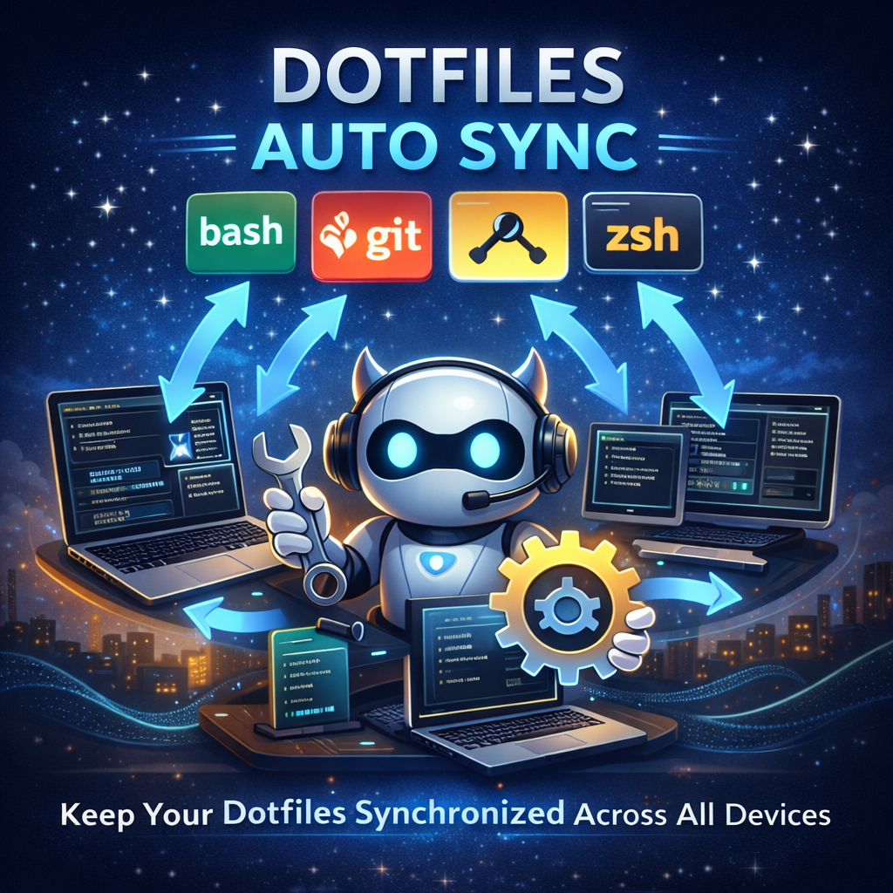

# Dotfiles Auto Sync



Automated dotfiles synchronization for macOS using LaunchAgent and yadm. Your dotfiles are automatically committed and pushed to git whenever they change - zero manual intervention required.

**Platform:** macOS only (uses LaunchAgent)
**Git Platform:** Any (GitHub, GitLab, Gitea, Bitbucket, self-hosted)

## Quick Start

```bash
# Install and start auto-sync
./dotfiles-auto-sync install

# Configure which files to backup
edit config/files.conf

# Check status and logs
./dotfiles-auto-sync status
./dotfiles-auto-sync logs
```

## Requirements

**Prerequisites:**

- macOS with Homebrew installed
- yadm initialized with remote repository configured
- SSH keys set up for git authentication

**Dependencies** (auto-installed if missing):

- `yadm` - Yet Another Dotfiles Manager
- `Homebrew` - macOS package manager

The installer verifies all requirements and guides you through any missing setup.

## How It Works

A macOS LaunchAgent monitors your dotfiles and triggers automatic syncs via:

1. **File watching** - Runs immediately when watched files change
2. **Scheduled backup** - Daily at 12:00 PM as a safety net

**Sync process:**

1. Fetch and pull from remote (`--rebase`)
2. Stash uncommitted changes if needed
3. Add configured dotfiles to yadm
4. Commit with timestamp
5. Push to remote repository
6. Log to `~/Library/Logs/de.sherrill.dotfiles-auto-sync.log`

## Installation

```bash
cd dotfiles-auto-sync
./dotfiles-auto-sync install
```

The installer will:

- Verify or install Homebrew and yadm
- Check yadm initialization and remote configuration
- Validate SSH connectivity
- Install and load the LaunchAgent
- Guide you through any missing configuration

If you need to set up yadm first:

```bash
yadm init
yadm remote add origin git@github.com:username/dotfiles.git
yadm add ~/.zshrc ~/.zprofile
yadm commit -m "Initial dotfiles"
yadm push -u origin main
```

## Configuration

**By default, nothing is backed up.** Edit `config/files.conf` to specify which dotfiles to sync.

The template includes common examples:

- Shell configs: `~/.zshrc`, `~/.zprofile`, `~/.bashrc`
- Terminal configs: `~/.config/starship.toml`, `~/.config/alacritty/alacritty.yml`
- Editor configs: `~/.vimrc`, `~/.config/nvim/init.vim`
- Git config: `~/.gitconfig`

**Note:** `files.conf` defines **what gets backed up** when sync runs. To control **what triggers** automatic syncs, update `WatchPaths` in the LaunchAgent plist (see Customization).

## Usage & Monitoring

```bash
dotfiles-auto-sync install    # Install and configure auto-sync
dotfiles-auto-sync sync       # Manually trigger sync
dotfiles-auto-sync status     # Check LaunchAgent status
dotfiles-auto-sync logs       # View sync logs
dotfiles-auto-sync uninstall  # Remove auto-sync system
dotfiles-auto-sync help       # Show help
dotfiles-auto-sync version    # Show version
```

**Check status:**

```bash
./dotfiles-auto-sync status
# Or: launchctl list | grep de.sherrill.dotfiles-auto-sync
```

**View logs:**

```bash
./dotfiles-auto-sync logs
# Or: tail -f ~/Library/Logs/de.sherrill.dotfiles-auto-sync.log
```

## Customization

### Adding/Removing Watched Files

Update **both** locations to enable immediate syncing:

1. **LaunchAgent WatchPaths** - Edit `~/Library/LaunchAgents/de.sherrill.dotfiles-auto-sync.plist`:

   ```xml
   <key>WatchPaths</key>
   <array>
       <string>/Users/yourname/.zshrc</string>
       <string>/Users/yourname/.zprofile</string>
       <!-- Add more paths -->
   </array>
   ```

2. **files.conf** - Edit `dotfiles-auto-sync/config/files.conf` with same files

3. **Reload LaunchAgent:**

   ```bash
   launchctl unload ~/Library/LaunchAgents/de.sherrill.dotfiles-auto-sync.plist
   launchctl load ~/Library/LaunchAgents/de.sherrill.dotfiles-auto-sync.plist
   ```

**Why both?** WatchPaths triggers the sync on file changes, files.conf defines what gets backed up. Without both, files only sync on the daily schedule.

### Changing Sync Schedule

Default: Daily at 12:00 PM (noon)

Edit `~/Library/LaunchAgents/de.sherrill.dotfiles-auto-sync.plist`:

```xml
<!-- Every 6 hours -->
<key>StartInterval</key>
<integer>21600</integer>

<!-- Or specific times (8 AM, 12 PM, 6 PM) -->
<key>StartCalendarInterval</key>
<array>
    <dict>
        <key>Hour</key>
        <integer>8</integer>
        <key>Minute</key>
        <integer>0</integer>
    </dict>
    <dict>
        <key>Hour</key>
        <integer>12</integer>
        <key>Minute</key>
        <integer>0</integer>
    </dict>
</array>
```

Reload LaunchAgent after changes (see above).

## Troubleshooting

**LaunchAgent not triggering:**

- Verify loaded: `./dotfiles-auto-sync status`
- Check permissions: `ls -l dotfiles-auto-sync` (must be executable)
- Review system logs: `log show --predicate 'subsystem == "com.apple.launchd"' --last 1h`

**Failed to push to remote:**

- Verify remote: `yadm remote -v`
- Test manual push: `yadm push`
- Check SSH authentication

**Merge conflicts:**

The sync script automatically stashes local changes before pulling. Conflicts are logged and can be resolved manually with `yadm`.

## Architecture

**CLI Design:**

- Single entry point: `dotfiles-auto-sync` (no extension)
- Subcommand pattern for clear intent
- Implementation located in `lib/` directory
- Dependency verification at startup
- Colored logging with status symbols

**Project Structure:**

```text
dotfiles-auto-sync/
├── dotfiles-auto-sync                          # Main entry point
├── lib/                                        # Core implementation
│   ├── logger.sh, deps.sh, backup-core.sh
│   ├── install-core.sh, uninstall-core.sh
├── config/
│   └── de.sherrill.dotfiles-auto-sync.plist.template
└── README.md
```

**Template System:** LaunchAgent plist uses placeholders (`{{HOME}}`, `{{DOTFILES_BACKUP_PATH}}`) dynamically replaced during installation for portability.

## Links

- [yadm documentation](https://yadm.io/)
- [LaunchAgent documentation](https://developer.apple.com/library/archive/documentation/MacOSX/Conceptual/BPSystemStartup/Chapters/CreatingLaunchdJobs.html)
- [LaunchControl](https://www.soma-zone.com/LaunchControl/) - GUI for managing LaunchAgents

## Acknowledgments

This project was developed with assistance from [Claude Code](https://claude.com/claude-code). All code and implementation decisions have been reviewed and verified by the author.
